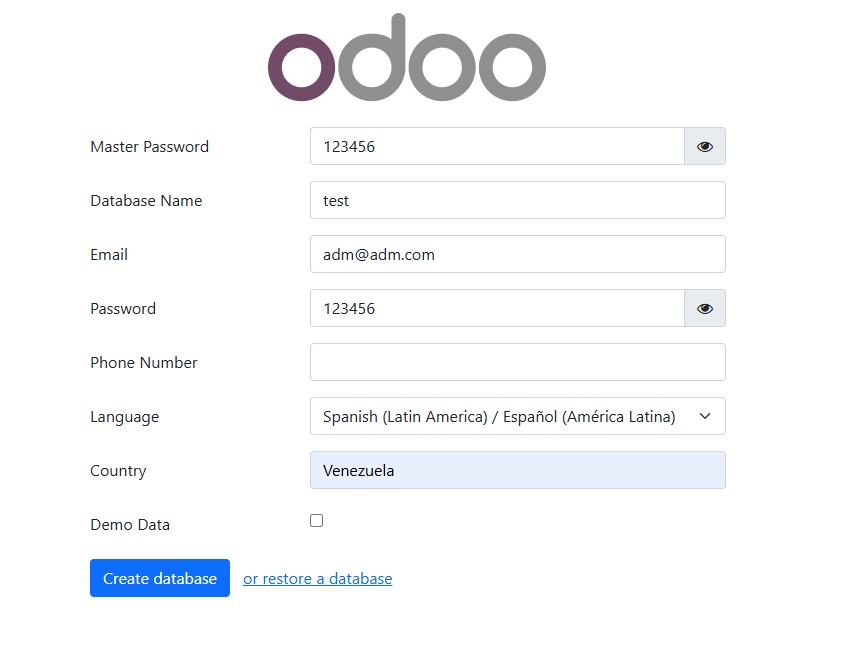
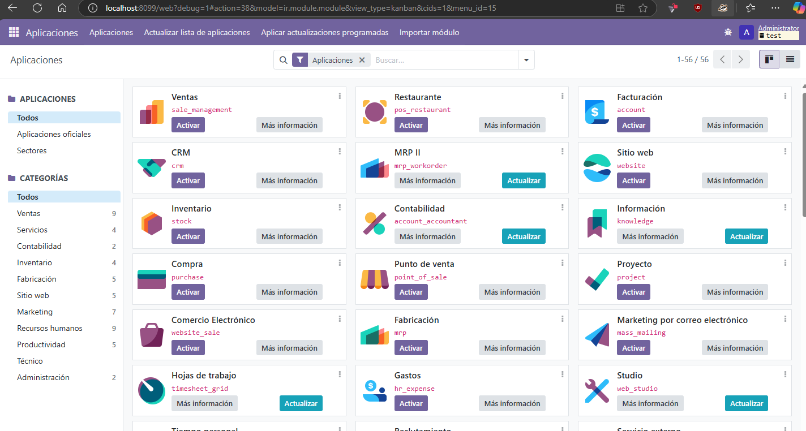

# Docker Compose for Odoo

## make sure docker its runing on your machine

## docker run

```sh
docker compose up -d
```

### addons folder

this folder contains a `__init__.py`

On this folder you'll dev odoo modules

## Credentials

admin and db credentials are at `config/odoo.conf`

## Configure odoo

Move to `http://localhost:8099/` if you didnt change ports at `odoo.conf`, `.env` or `docker-compose.yaml`


Then click >>Create database<<

## activate debug mode

after login at url set `?debug=1`

example: `http://localhost:8099/web?debug=1`



have fun development
